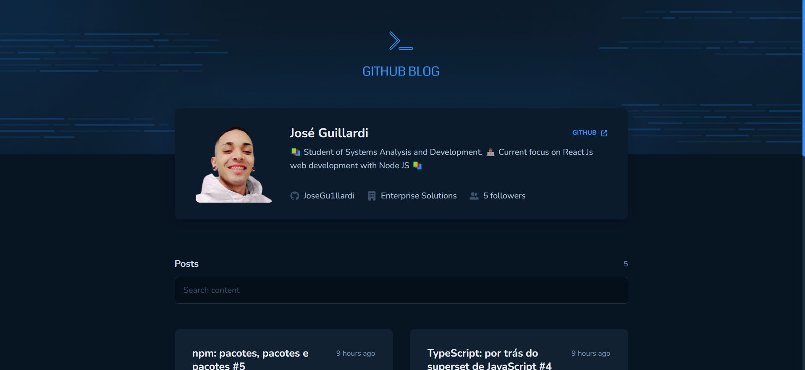
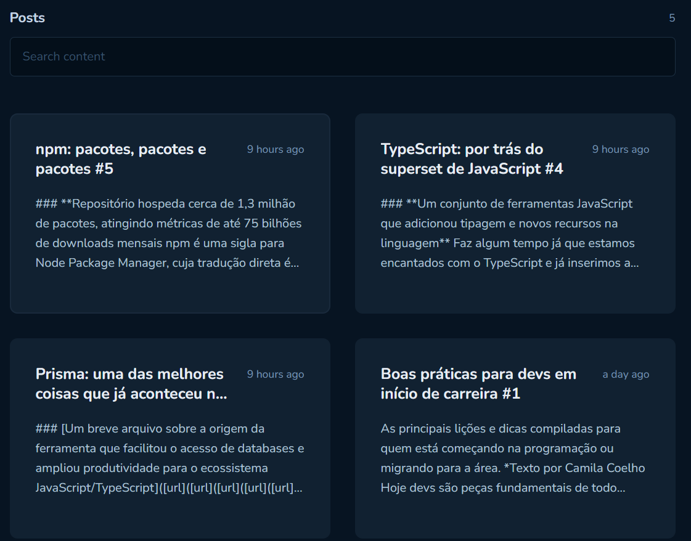
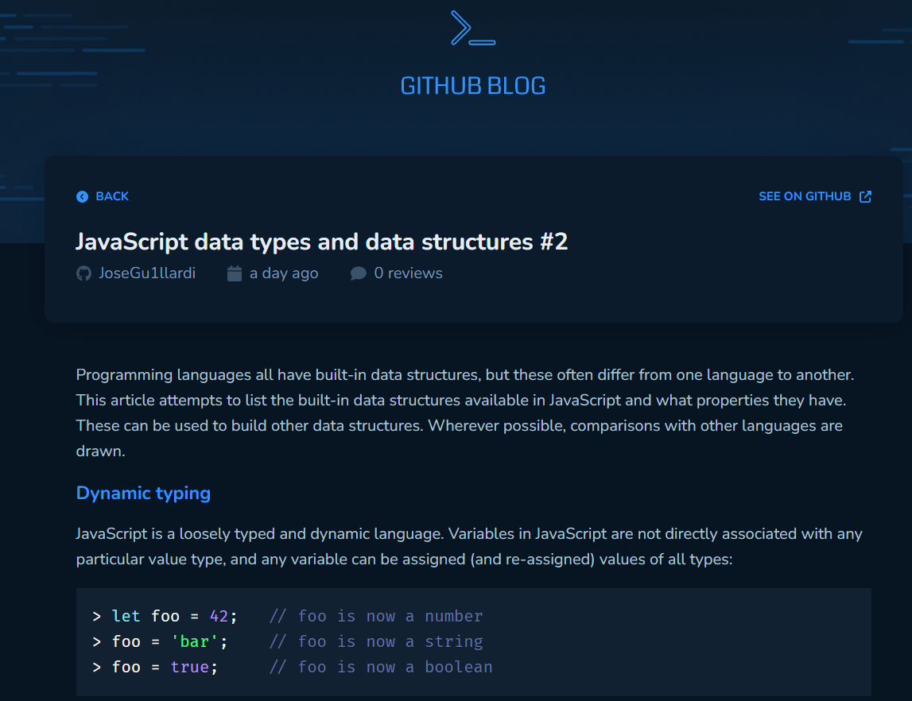

<h1 align="center">
  
</h1>

<h3 align="center">
  Web Application for Github Blog
</h3>

<h1 align="center">
  
</h1>

<h1 align="center">
  
</h1>

  <a href="#-about-the-project">About the project</a>&nbsp;&nbsp;&nbsp;|&nbsp;&nbsp;&nbsp;
  <a href="#-technologies">Technologies</a>&nbsp;&nbsp;&nbsp;|&nbsp;&nbsp;&nbsp;
  <a href="#-getting-started">Getting started</a>&nbsp;&nbsp;&nbsp;|&nbsp;&nbsp;&nbsp;
  <a href="#-how-to-contribute">How to contribute</a>&nbsp;&nbsp;&nbsp;|&nbsp;&nbsp;&nbsp;
  <a href="#-license">License</a>

## ✅ About the project

This project is the third ignite Rocketseat challenge from the reactjs study platform.

## 🚀 Technologies

Technologies that I used to develop this api

- [React JS](https://pt-br.reactjs.org/)
- [Vite JS](https://vitejs.dev/)
- [TypeScript](https://www.typescriptlang.org/)
- [Styled Components](https://styled-components.com/)
- [Axios](https://axios-http.com/)

## 📝 License

This project is licensed under the MIT License - see the [LICENSE](LICENSE) file for details.

---

Made with 💚 by José Guillardi 🤝 [See my linkedin](https://www.linkedin.com/in/jos%C3%A9-wellington-ribeiro-a26418163/)
